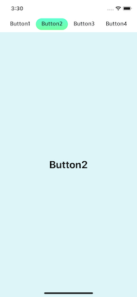
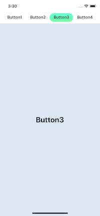
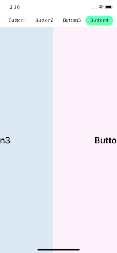

[]()

### JGTabBarView
 - 심플한 메소드를 통해 탭 화면을 곧 바로 구성이 가능
 - 스와이프 제스처를 이용하여 탭 간 이동이 가능
 - Interface Builder에서도 삽입 가능

### Demo







'''[swift]

```
// create UIViewController (with JGTabBar protocol)
class TabViewController: UIViewController, JGTabBar

// XIB View variable
@IBOutlet weak var tabBarView: JGTabBarView!

override func viewDidLoad() {
    super.viewDidLoad()

    var views: [TabViewController] = []
    (1...4).forEach { (index) in
        let tabViewController = TabViewController(nibName: "TabViewController", bundle: nil)
        // Tab Button Title.
        tabViewController.tabTitle = "Button\(index)"
        views.append(tabViewController)
    }

    // set tabs
    tabBarView.tabs = views 
}
```

